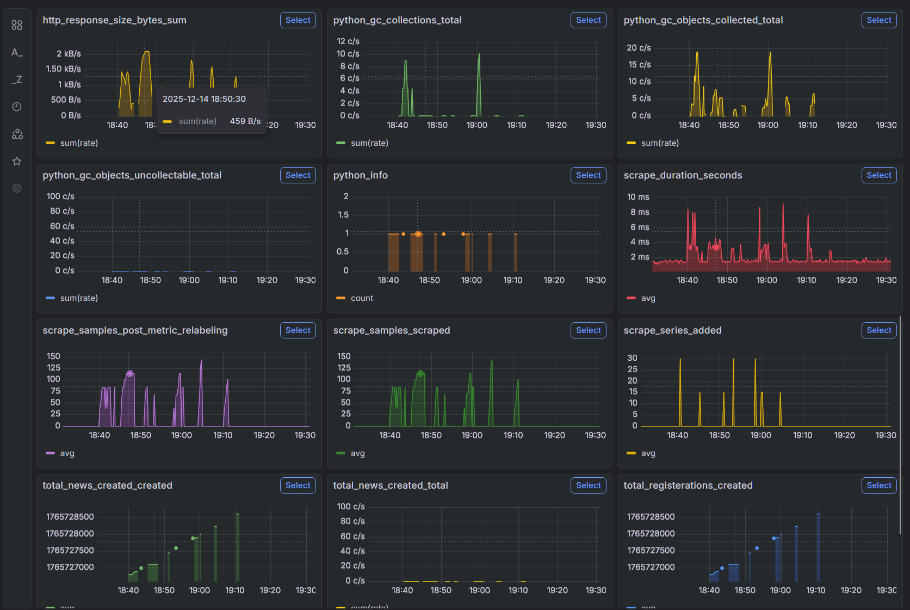
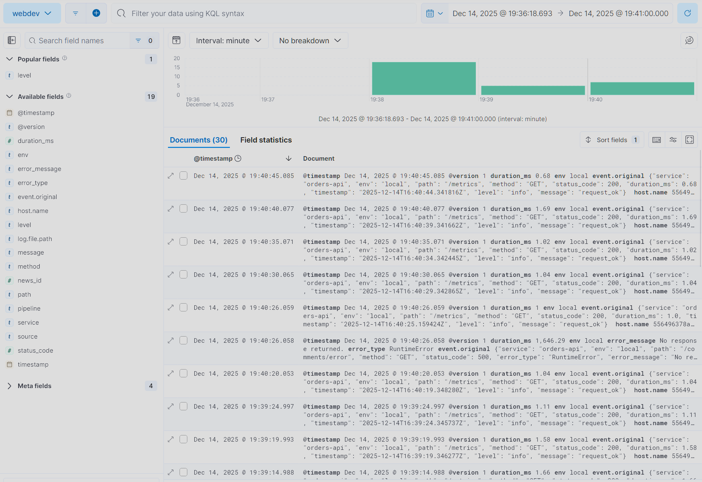
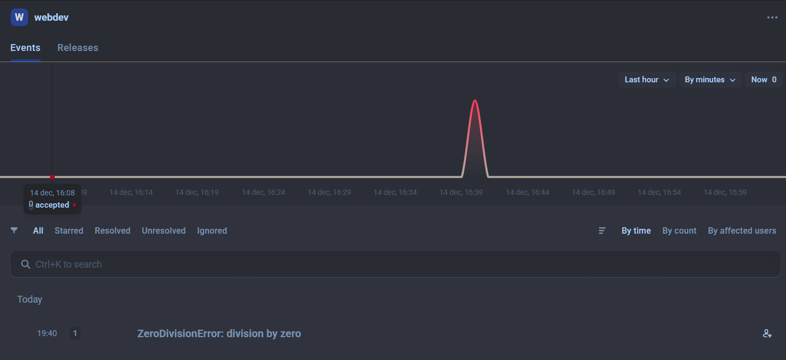

## Метрики
В качестве инструмента для сбора метрик использовался prometheus, соответственно доступны базовые метрики этого инструмента. Дополнительно были добавлены метрики количества созданных новостей и количества регистраций пользователей, а также метрика отправления уведомлений о новостях (при создании или в конце недели).

Все метрики доступны для просмотра в "сыром" виде по пути /metrics или в формате json по пути /metrics/json.

Для просмотра метрик в удобном интерфейсе можно воспользоваться grafana. Скриншот графиков оттуда приведен ниже.

## Логирование
Для ведения логов в json формате используется structlog, логи сохраняются локально по пути /logs/app.log. Также было переделано логирование из предыдущих модулей, чтобы оно тоже выполнялось при помощи structlog. Далее при помощи связки logstash-elasticsearch-kibana логи можно посмотреть в графическом интерфейсе, имея возможность сортировать их по полям. Ниже представлен скриншот из kibana, где видно отображение логов.

---
Для трекинга ошибок был создан проект в Hawk и подключен к нашему приложению. На скриншоте пример графика при возникновении ошибки в приложении.
