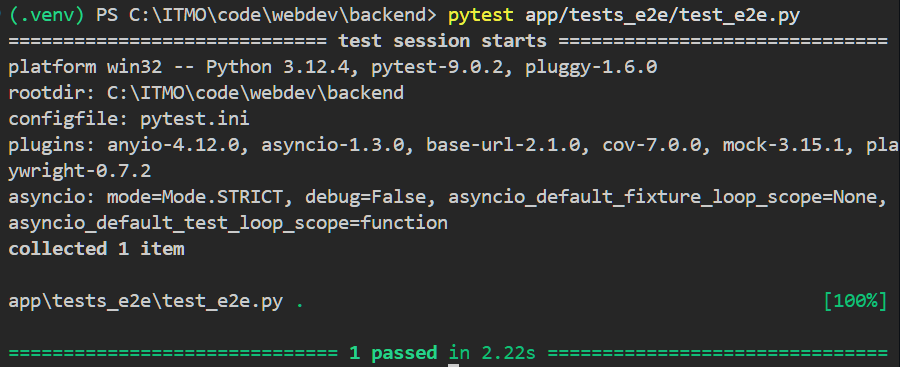
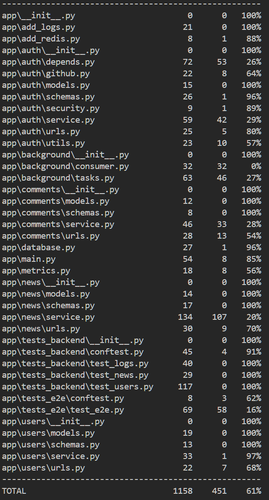

Тестирование было реализовано при помощи pytest. Его конфигурация храниться в файле pytest.ini в корне проекта.

Все тесты хранятся в app/tests и разделены на две части tests_backend (unit и интеграционные тесты) и tests_e2e (end to end тесты UI)

Покрытие тестами составляет ~61% (~64% у backend тестов без e2e)

Для успешного прохождения e2e тестов, надо установить браузер для playwright (`playwright install chromium`)

Ниже представлены скриншоты с прохождением e2e теста и информацией о покрытии

